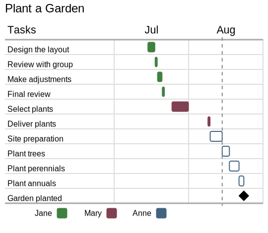

# Gantt Chart Generator

[](https://github.com/jlyonsmith/gantt_chart/blob/main/coverage.json)
[](https://crates.io/crates/gantt_chart)
[](https://docs.rs/gantt_chart)

*New in v2.0, the tool now generates SVG files.*

This is a tool to generate simple Gantt charts. Here's some sample output:



The focus of the tool is the generation of the chart from existing data and not the calculation of project dependencies.

Install with `cargo install gantt_chart`.  Run with `gantt-chart`.  If you have [resvg](https://crates.io/crates/resvg) installed, you can generate a PNG bitmap with:

```sh
resvg example/project.svg example/project.png --background '#ffffff'`
```

It has the following features:

- Takes input date in a simple [JSON5](https://json5.org/) format
- Groups tasks by resource
- Schedules a tasks for each resource as soon as the previous one is complete
- Allows the creation of zero length project milestones
- Automatically generates resources colors using a [Golden Ratio](https://martin.ankerl.com/2009/12/09/how-to-create-random-colors-programmatically/) algorithm
- Customizable column widths
- SVG allows easy scaled conversion to other formats
- Tasks can be shown as done or not-done
- You can add a dotted line to mark the current or other date
- Can generate a table of resources
- Takes into account weekends and extends task durations as needed so the start & end to falls on a weekday

You can use the tool to quickly generate high level project timelines.  For full blown Gantt functionality, I recommend a tool like [OmniPlan](https://www.omnigroup.com/omniplan).
